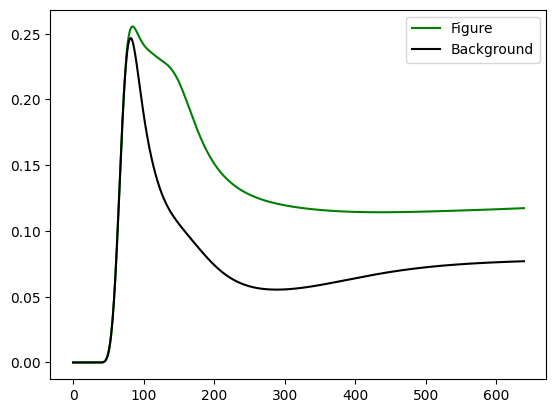

# README

# Table of Contents

- [Installation](#Installation)
    - [How to Install Anaconda for Using Git](#How-to-install-Anaconda-for-Using-Git)
    - [Create your Anaconda Environment for Model Use](#Create-your-Anaconda-Environment-for-Model-Use)
- [Usage](#Usage)

# Installation

The best way to run any Python package is using a (virtual) Python environment since
many packages require different dependency versions. Probably the easiest way to
install the required environment is with Anaconda. Anaconda is a science platform
for Python and R which makes managing such environments a bit easier. Included in
the Anaconda download is the Spyder IDE which you can use to edit the python
files in this package. You can also use the Anaconda prompt to pull the latest version of the model onto your machine. But first, you will need to download and install Anaconda.

## How to Install Anaconda for Using Git

Anaconda is an open-source distribution of the Python and R programming languages for large-scale data processing, predictive analytics, and scientific computing. It comes with many useful packages and tools, including Git. Here are the steps to install Anaconda and configure it for using Git from Anaconda prompt on a Windows machine:

### Step 1: Download Anaconda

Visit the [Anaconda download page](https://www.anaconda.com/products/individual) and download the latest version of Anaconda for Windows. Make sure to choose the correct version (32-bit or 64-bit) according to your Windows operating system.

### Step 2: Install Anaconda

After downloading the Anaconda installer, double-click on it to launch the installation wizard. Follow the instructions on the screen to install Anaconda to its default location.

### Step 3: Configure Git in Anaconda

Open the Anaconda prompt and type the following commands to configure Git in Anaconda:

```
conda install git
git config --global user.name "Your Name"
git config --global user.email "your-email@example.com"

```

Replace "Your Name" and "[your-email@example.com](mailto:your-email@example.com)" with your actual name and email address. These commands will install Git in Anaconda and set your Git user name and email globally.

### Step 4: Test Git

To test that Git is correctly installed and configured in Anaconda, open the Anaconda prompt and type the following command:

```
git --version
```

This command should display the version of Git that you installed.

Congratulations! You have successfully installed Anaconda and configured it for using Git from Anaconda prompt on a Windows machine. Now you can use Git commands from the Anaconda prompt to manage your Git repositories.

## Create your Anaconda Environment for Model Use

Anaconda works with ************environments.************ These will contain all the dependencies needed to run code. It is useful to keep separate environments since different projects may have different dependencies or even different versions of the same dependency. We therefore need to create an environment and every time we want to use it, we must activate it. Once you have downloaded Anaconda, you can perform the following steps in the Anaconda Prompt to create the environment and install the required dependencies.

### Step 1: Create a new environment and activate it

```jsx
conda create --name figure_ground_segmentation python=3.9
conda activate figure_ground_segmentation
```

### Step 2: Pull the model to your machine

Since we installed git in conda, we can use it to pull (download) the code repository (repo) to your machine. Note however, that within conda, you are still working within your normal file directory. Everything you do within the Anaconda prompt will happen on your machine. The only difference is that when you run code, your machine will run it with the dependencies specified by Anaconda. So don’t get confused with environments and directories, they are separate.

Change to a directory on your machine in which you want the model repo to be stored in and then pull the repo

Change directory to the root of this repo

```jsx
cd <your_desired_directory_path>
git clone https://github.com/zachnudels/salience_model
```

### Step 3: Install the required dependencies

The repo has a file specifying the dependencies it uses. We can use that to automatically install all of these using pip. But first we must change directory to the model repo

```jsx
cd figure_ground_segmentation
pip install -r requirements.txt
```

# Usage

The model (`Model` object) contains various `Layer` objects each representing one layer of the visual system. The dynamics in each layer are the same and are defined in `layer.py`. Each layer has multiple “cells”, each cell with its own dynamics and these cells are coupled. 

On each update step, the `Model` runs the update method for each layer. Additionally, the activity from each layer is fed forward (or backward) to the layer above (or below) it. Interpolation functions are used to do so as the receptive field sizes become larger at each higher layer. 

To run the model, you have to construct  you have to create a `Model` object. Since our experiment is dependent on orientation, we have implemented an extenion of the model called `OrientationModel`. 

```python
model = OrientationModel(
                 parameters: pd.DataFrame,
                 channels: int,
                 input_dim: Tuple[int, int],
                 input_activity: np.ndarray = None,
                 recording_sites: Dict[str, Dict[str, Tuple[int, int]]] = None,
                 initial_recordings: Dict[str, List[float]] = None,
                 )
```

Where 

- `parameters` is a pandas DataFrame containing the parameters information used by the model
- `channels` is the number of tuning curves or channels
- `input_dim` is the input dimension of the model
- `input_activity` is the input image (if this is `None`, it must be set in the `model.update()` method).
- `recording_sites` is a dictionary containing the names and locations (X,Y) of where we want to record activity from  for each layer
- `initial_recordings` is a dictionary containing the `recording_sites` names and initial lists of floats to add on to the beginning of our recording arrays

To replicate the Poort et al model input we can use the helper functions in the package’s `image_generation.py` script. Then we set the figure recording location to the center, and the background location in the middle of a quadrant. We create two arrays of 40 zeros to prepend to our recorded results and then read our parameters from a file. We then construct and run the model for 600 timesteps at a timestep of 10ms.

```python
from salience_model import OrientationModel
from salience_model.utilities import generate_block

V1_dim = (121, 121)
figure_dim = (25, 25)
orientations = [45, 135]
na = generate_block(input_dim=V1_dim,
                    figure_dim=figure_dim,
                    bg_orientation=orientations[0],
                    figure_orientation=orientations[1])

# Define the recording sites in each layer 
sites = {'V4': {'cen': (7, 7), 'bck': (1, 1)},
         'FEF': {'cen': (7, 7), 'bck': (1, 1)}}

# Add on 40 timesteps with zero activity
initial_recordings = {'cen': [0 for _ in range(40)],
                      'bck': [0 for _ in range(40)]}

# Read the parameter file
parameters = pd.read_csv("parameters2.csv", index_col=0)

# Construct the salience_model
model = OrientationModel(parameters=parameters,
                         channels=12,
                         input_dim=V1_dim,
                         input_activity=na,
                         recording_sites=sites,
                         initial_recordings=initial_recordings)

# Run 600 10e-3 timesteps
model.simulate(n=600, timestep=10e-3)
```

As the model runs, it saves the recorded results in the `recordings` dictionary which we can then access to, for example, plot the time courses of figure and background.

```python
from matplotlib import pyplot as plt

plt.plot(model.recordings['cen'], 'g', label="Figure")
plt.plot(model.recordings['bck'], 'k', label="Background")
plt.legend()
```

To produce something like



## Two Figure Example

To replicate the behavioural experiment in van Heusden et al (2022)

```python

from salience_model import OrientationModel
from salience_model.utilities import generate_2_blocks

# Define the dimensions and orientations
V1_dim = (177,177)
figure_dim = (9, 9)
orientation = [10, -30, 30]
target_locations = (((69, 69), (107, 107)), ((69, 107), (107, 69)))

# Generate the stimulus
na = generate_2_blocks(input_dim=V1_dim,
                        figure_dim=figure_dim,
                        bg_orientation=orientation[0],
                        figure_orientations=[orientation[1],orientation[2]],
                        midpoints=target_locations)
    
# Define the recording sites in each layer
sites = {layer: {"cen1": (8,8), "cen2": (13,13), "bg": (8,13)} 
					for layer in ['V4', 'FEF']}
initial_recordings = {'cen1': [0 for _ in range(40)], 
					  'cen2': [0 for _ in range(40)], 
					  'bg':   [0 for _ in range(40)]}

# Read the parameter file
parameters = pd.read_csv("parameters2.csv", index_col=0)

# Construct the salience_model
model = OrientationModel(parameters=parameters,
                         channels=12,
                         input_dim=V1_dim,
                         input_activity=na,
                         recording_sites=sites)

# Simulate 600 10e-3 timesteps
model.simulate()
```